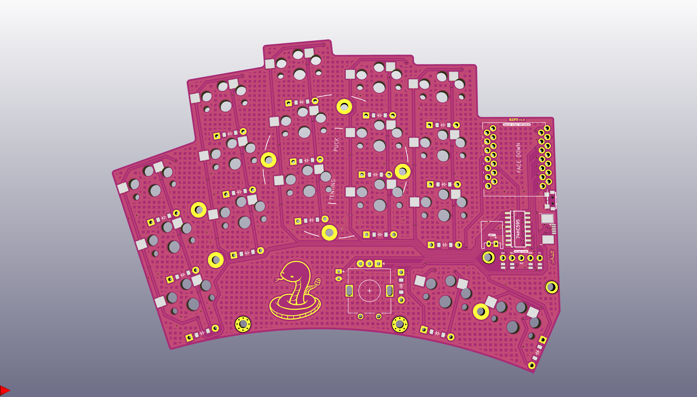
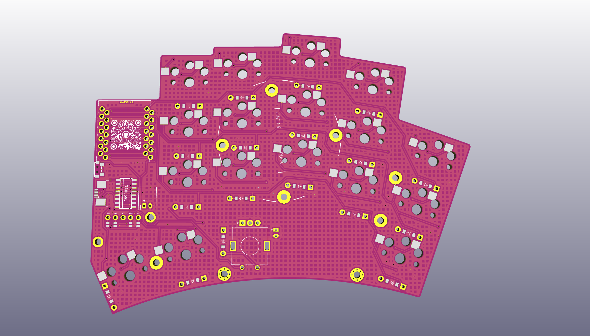
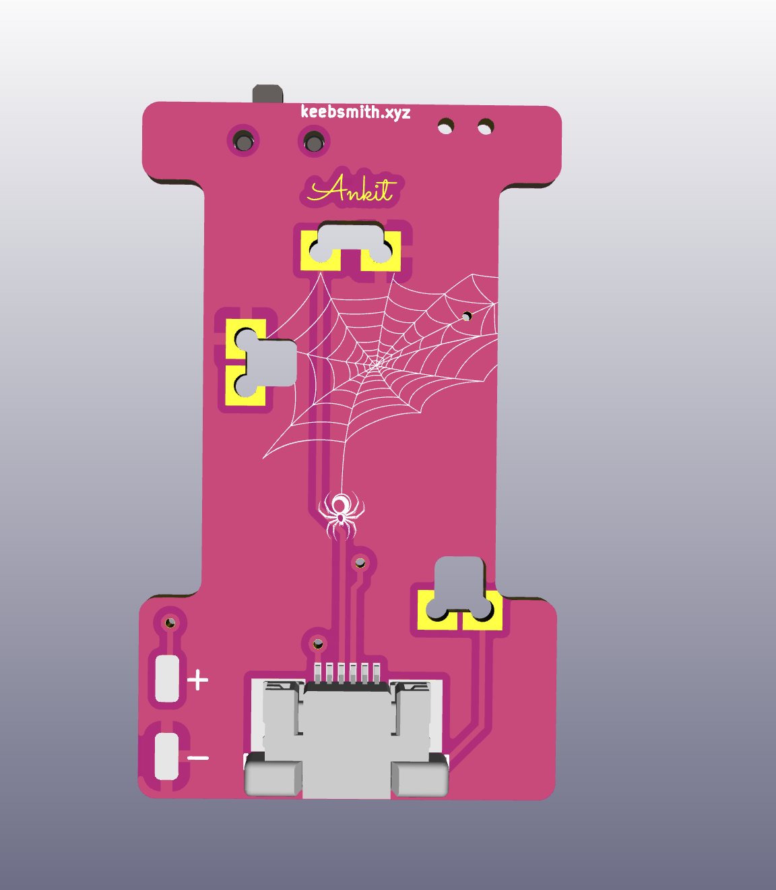

    

Rift is a 34-key wireless split keyboard featuring Nice!View/OLED display ,Rotary Encoder (EC11/EC12) and optional trackpad support. It runs on [ZMK](https://zmk.dev/) firmware and is powered by the [Seeed Xiao nRF52840](https://www.seeedstudio.com/Seeed-XIAO-BLE-nRF52840-p-5201.html) board.
## Images
| Board                 | Front                                             | Back                                               |
| :--:                  | :--:                                              | :--:                                               |
| Keyboard PCB Front    |         |           |
| Xiao Extension        |  |  |

### Inspiration
- [Ferris(Sweep)](https://github.com/davidphilipbarr/Sweep)